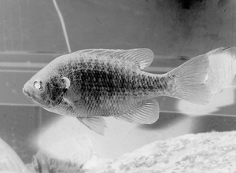
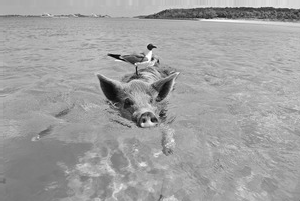

# PSET
Esse é um PSET passado pelo professor Abrantes Araujo Silva Filho na matéria de linguagem de programação do curso de ciência da computação, ela é inspirada em uma atividade da disciplina MIT6.009:Fundamentals of Programming.


# Resposta para as questões do PSET

## Questão 1:
**Se você passar essa imagem pelo filtro de inversão, qual seria o output esperado? Justifique sua resposta.**
- largura: 4
- altura: 1
- pixels: [29,89,136,200]

ESPERADO:
- largura: 4
- altura: 1
- pixels: [229,166,119,55]

Para a imagem ser invertida em um filtro de inversão, é necessário subtrair o valor de cada pixel de 255.
Portanto, o pixel [29,89,136,200] se tornaria [229,166,119,55].

## Questão 2: 
**Faça a depuração e, quando terminar, seu código deve conseguir passar em todos os testes do grupo de teste TestInvertida (incluindo especificamente o que você acabou de criar). Execute seu filtro de inversão na imagem test_images/bluegill.png, salve o resultado como uma imagem PNG e salve a imagem.
Foram alteradas as fuções, conforme comentada no código:**

 - get_pixel
 - set_pixel
 - aplicar_por_pixel
 - invertida 
 
 
Inversão da imagem:


=>


## Questão 3:
**considere uma etapa de correlacionar uma imagem com o seguinte kernel:**

- 0.00 -0.07 0.00
- -0.45 1.20-0.25
- 0.00 -0.12 0.00

**Aqui está uma parte de uma imagem de amostra,com as luminosidades específicas de alguns pixels:**


**Qual será o valor do pixel na imagem de saída no local indicado pelo destaque vermelho? Observe que neste ponto ainda não arredondamos ou recortamos o valor, informe exatamente como você calculou. Observação: demonstre passo a passo os cálculos realizados.**

<ol>
    <li>Primeiro vamos montar a expressão de aplicação do kernel k em I, onde cade numero do kernel vai ser aplicado em um pixel adjacente do pixel da imagem em que sera aplicada :
    O =  k * I</br>       O = (80 * 0.00) + (53 * -0.07) +  (99 * 0.00) </br> + (129 * -0.45) + (127 * 1.20) + (148 * -0.25)</br> +   (175 *  0.00) + (174 * -0.12) + (193 * 0.00)</li> 
    </br>
    <li> Teremos então: </br>
    0 + (-3.71) + 0 +  (-58.55) + (152.4) + (-37) + 0 + (-20.88) + 0 = 32.76 
    </li>
    </br>
    <li>
    O valor do pixel na imagem de saída, no local indicado pelo destaque vermelho, é 32.76.
    </li>
</ol>

## Questão 4:
**Quando você tiver implementado seu código, tente executá-lo em `test_images/pigbird.png` com o seguinte kernel 9×9:**

 0 0 0 0 0 0 0 0 0 </br>
 0 0 0 0 0 0 0 0 0 </br> 
 1 0 0 0 0 0 0 0 0 </br>
 0 0 0 0 0 0 0 0 0 </br>
 0 0 0 0 0 0 0 0 0 </br>
 0 0 0 0 0 0 0 0 0 </br>
 0 0 0 0 0 0 0 0 0 </br>
 0 0 0 0 0 0 0 0 0 </br>
 0 0 0 0 0 0 0 0 0 </br>

**Ao rodar esse kernel, salve a imagem resultante.**

Função correlação
```python
    def correlacao(self, filtro):
        resultado = Imagem.nova(self.largura, self.altura)
        pontocentral = len(filtro) // 2

        for x in range(self.largura):
            for y in range(self.altura):
                soma = 0
                for i in range(len(filtro)):
                    for j in range(len(filtro)):
                        ix = x + i - pontocentral
                        jy = y + j - pontocentral
                        soma += self.get_pixel(ix, jy) * filtro[i][j]
                    
                resultado.set_pixel(x,y, soma)

        self.verificar_pixels()
        return resultado
```
Teste da imagem com o kernel
```python
    def test_filtroKernel(self):
        im = pset1.Imagem.carregar('test_images/pigbird.png')
        arquivo_saida = os.path.join(TEST_DIRECTORY, 'test_results', 'pigbirdKernel.png')

        kernel =[
        [0, 0, 0, 0, 0, 0, 0, 0, 0],
        [0, 0, 0, 0, 0, 0, 0, 0, 0],
        [1, 0, 0, 0, 0, 0, 0, 0, 0],
        [0, 0, 0, 0, 0, 0, 0, 0, 0],
        [0, 0, 0, 0, 0, 0, 0, 0, 0],
        [0, 0, 0, 0, 0, 0, 0, 0, 0],
        [0, 0, 0, 0, 0, 0, 0, 0, 0],
        [0, 0, 0, 0, 0, 0, 0, 0, 0],
        [0, 0, 0, 0, 0, 0, 0, 0, 0]]
        resultado = im.correlacao(kernel)

        resultado.salvar(arquivo_saida)
```

Aplicação do kernel </br>

=>


## Questão 5:
**se quisermos usar uma versão desfocada B que foi feita com um kernel de desfoque de caixa de 3 × 3, que kernel k poderíamos usar para calcular toda a imagem nítida com uma única correlação? Justifique sua resposta mostrando os cálculos.**

O kernel de desfoque de caixa 3 × 3 é:

    [   
        [1/9, 1/9, 1/9],
        [1/9, 1/9, 1/9],
        [1/9, 1/9, 1/9]
    ]

Formula de nitidez<br>
\[ S{x,y} = round(2 * I{x,y} - B{x,y}) \]


    Multiplicar a Imagem Original por 2:

    [
        [ 0,  0,  0],
        [ 0,  2,  0],
        [ 0,  0,  0]
    ]

    Subtrair o Kernel de Desfoque:
    
    [
        [ 0,  0,  0],
        [ 0,  2,  0],
        [ 0,  0,  0]
    ]
    -
    [
        [1/9, 1/9, 1/9],
        [1/9, 1/9, 1/9],
        [1/9, 1/9, 1/9]
    ]
    =
    [
        [-1/9, -1/9, -1/9],
        [-1/9,  17/9, -1/9],
        [-1/9, -1/9, -1/9]
    ]


    O kernel de nitidez ( K ) que combina a operação de nitidez com o kernel de desfoque de caixa 3 × 3 é:
    [
    [-1/9, -1/9, -1/9],
    [-1/9,  17/9, -1/9],
    [-1/9, -1/9, -1/9]
    ]

Logo subtraímos o kernel de desfoque de caixa de cada elemento, resultando em valores negativos para os elementos adjacentes e um valor central aumentado.

**Quando terminar e seu código passar nos testes relacionados à nitidez, execute seu filtro de nitidez na `imagemtest_images/python.png` usando um kernel de tamanho 11, salve o resultado como uma imagem PNG.**

 
=>

